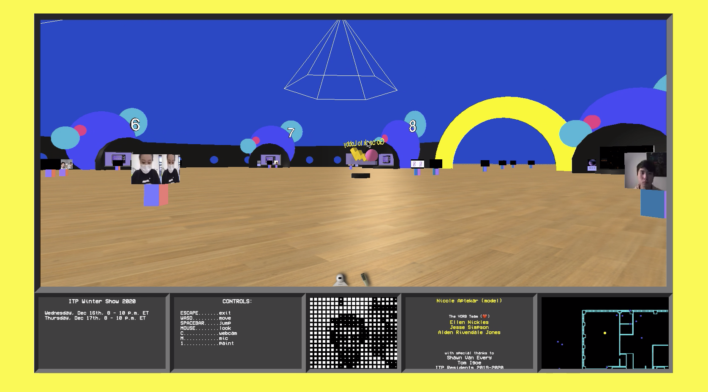

## About

**YORB2020** is a multi-user social space online, created at NYU's [Interactive Telecommunications Program](itp.nyu.edu) in response to the quarantine conditions of COVID-19, this project attempts to provide the ITP community with a shared virtual space to hang out, collaborate and work near each other.  

## History

Yorb draws its inspiration from a 1990s interactive television show *YORB* (Your Orb) created by Dan O'Sullivan for Manhattan Neighborhood Network (a public access television station in New York City).  It existed and evolved over several years as an ongoing project at the [Interactive Telecommunications Program](https://tisch.nyu.edu/itp) (ITP) at New York University.  

For more information about the television show *YORB*, watch some of the videos on the [Unofficial YORB Video Archive](https://www.youtube.com/playlist?list=PLsUfmDKc_P3gB0oW3y9VUZhZZ2vjHkTSv) or check out the *Yarchive* at [yorb.online](https://yorb.online/).

### Getting Involved:

For more information about how the project is built and how you could be involved, take a look at [CONTRIBUTING.md](/docs/CONTRIBUTING.md).

### License:

Still figuring it out... For the moment, please contact me if you want to use any part of this repo.  

### Credits

Aidan Nelson, Ellen Nickles, Nicole Aptekar, Jesse Simpson, Alden Rivendale Jones and many [open source projects](/docs/CREDITS.md).

