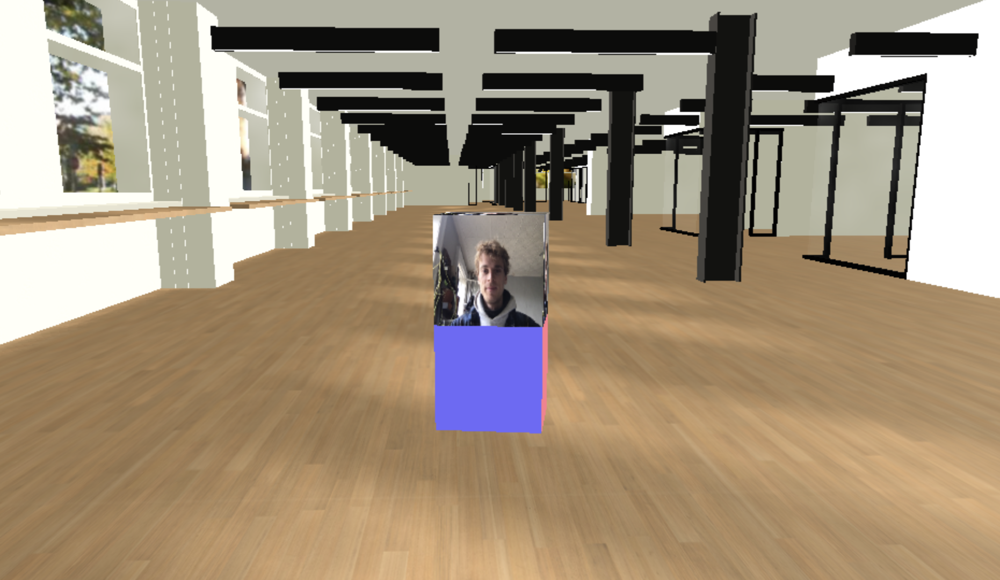
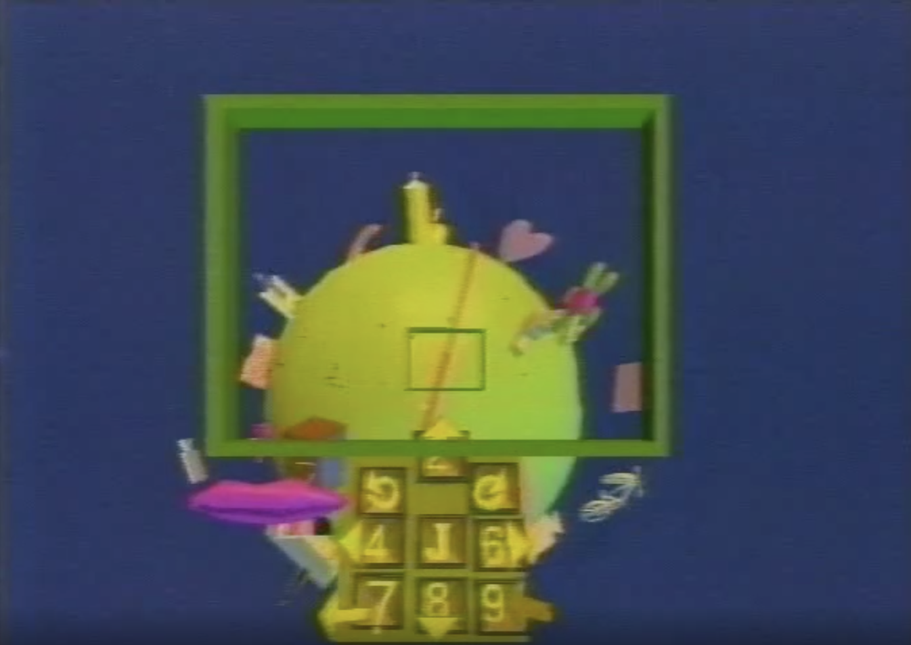

YORB2020 is a shared virtual space to hang out, collaborate and work near each other.  

## About

**YORB2020** is based on the 1990s interactive television show *YORB* (Your Orb) created by Dan O'Sullivan for Manhattan Neighborhood Network -- a public access television station in New York City.  It existed and evolved over several years as an ongoing project at the [Interactive Telecommunications Program](https://tisch.nyu.edu/itp) (ITP) at New York University.  

For more information about *YORB*, see the *YARCHIVE* at [yorb.online](yorb.online).

**YORB2020** is a project built by a number of the current [Researchers in Residence](https://itp.nyu.edu/residents/) at ITP.  Inspired by YORB and created in response to the quarantine conditions of COVID-19, this project attempts to provide the ITP community with a shared virtual space to hang out, collaborate and work near each other.  

### Getting Involved:

For more information about how the project is built and how you could be involved, take a look at [CONTRIBUTING.md](/docs/CONTRIBUTING.md).

### Credits

Ellen Nickles, Aidan Nelson, Nicole Aptekar, Jesse Simpson, Alden Rivendale Jones and many [open source projects](/docs/CREDITS.md).

